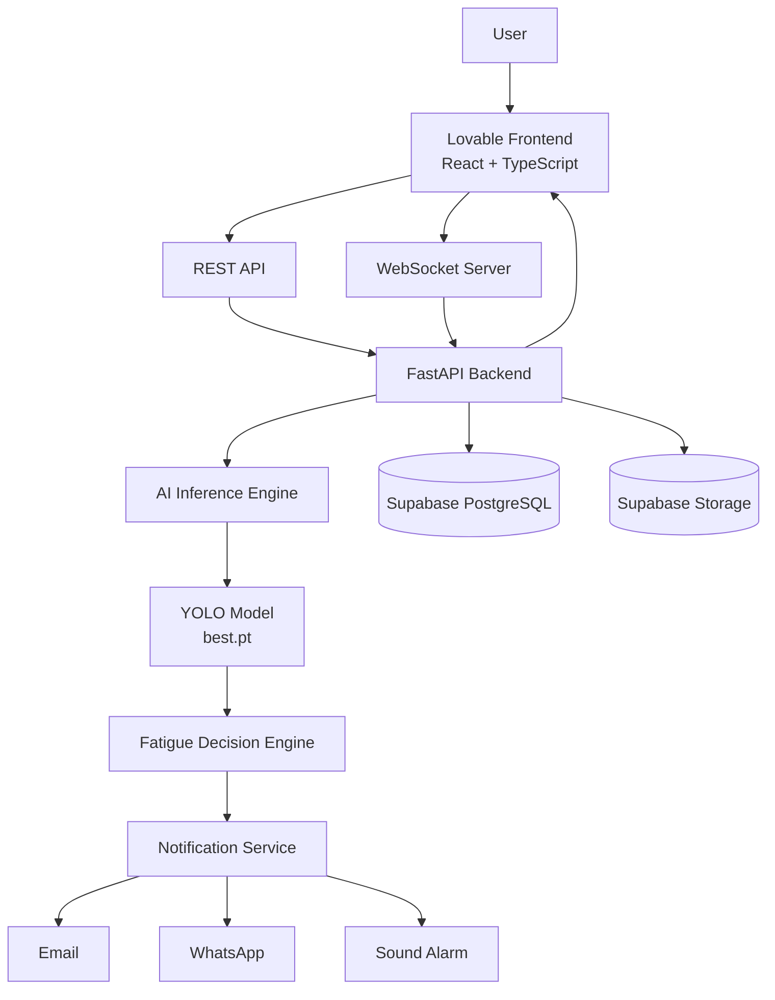
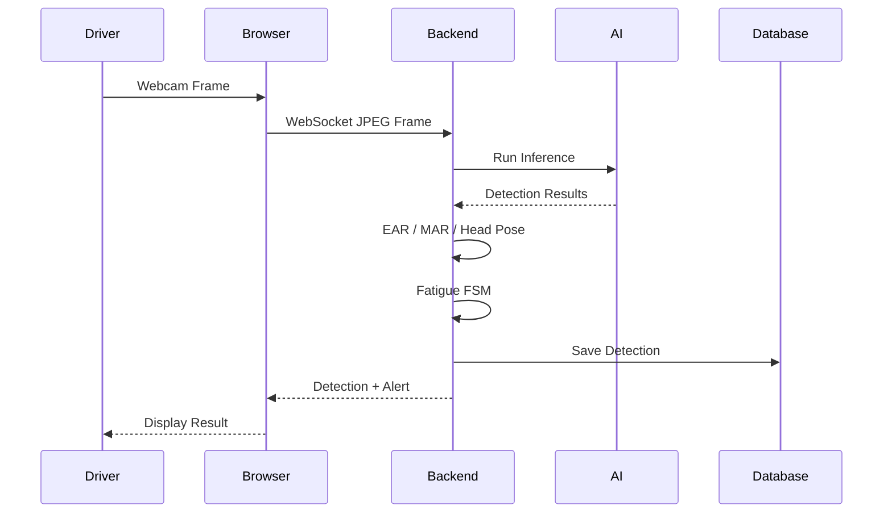
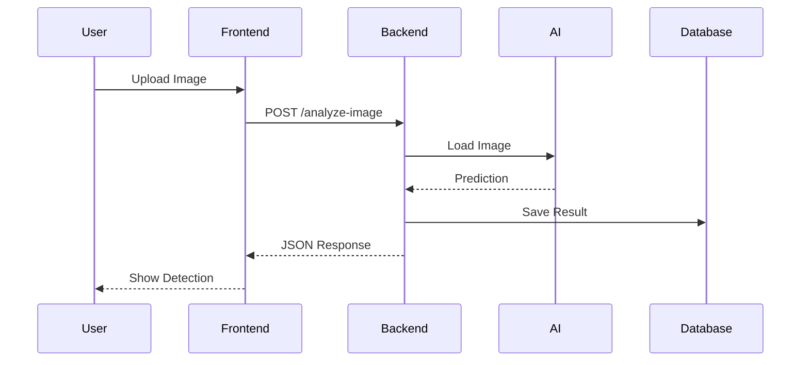
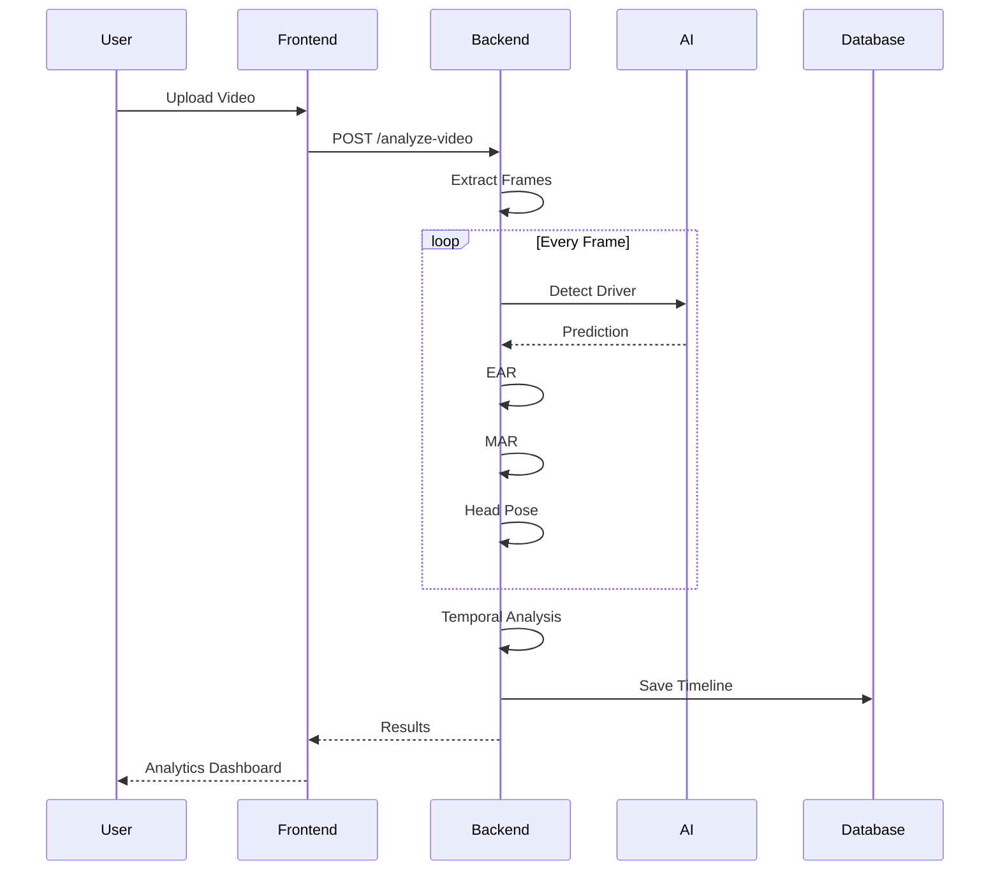
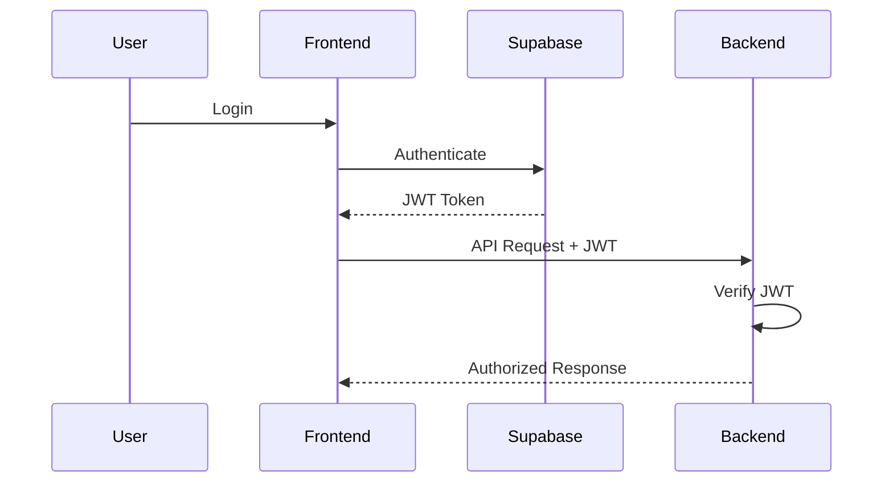
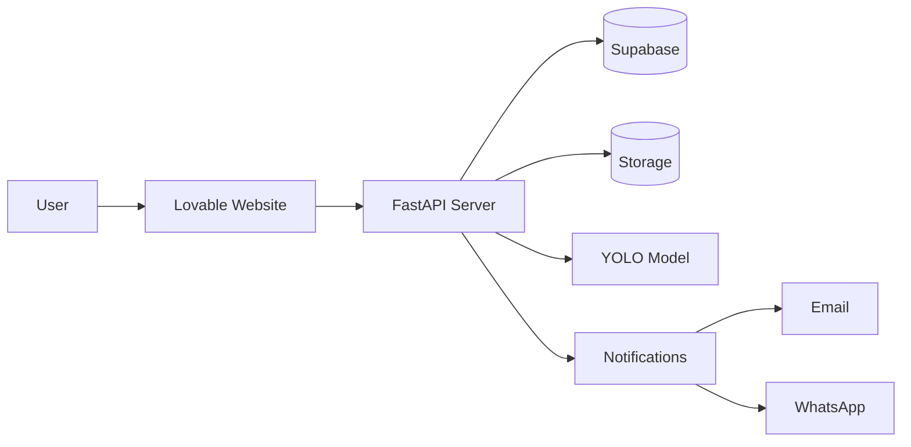
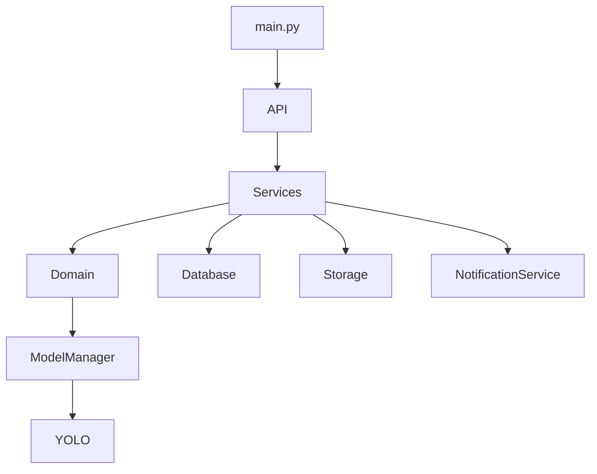
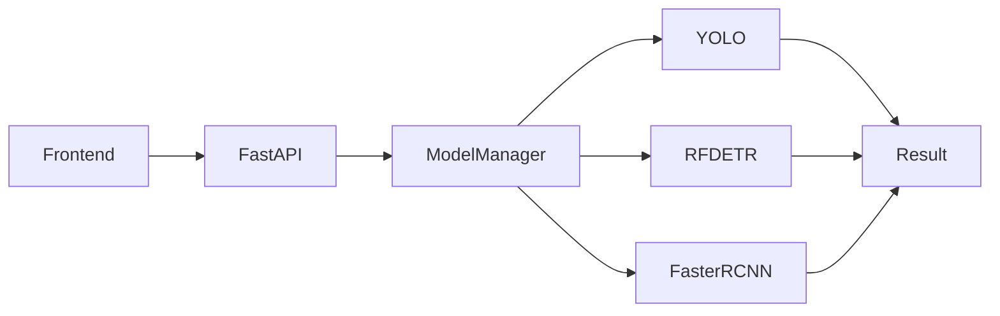
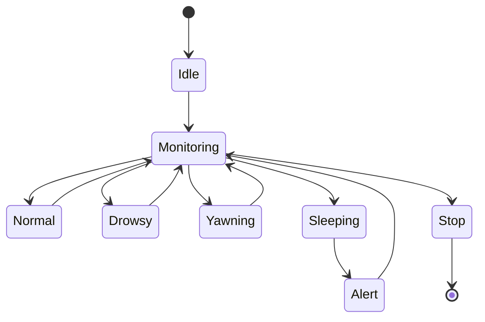

> **Important for AI Assistants (Claude/ChatGPT):**
>
> This document is part of the official software specification for the AI-Based Driver Drowsiness Detection System.
>
> Any generated code must follow this specification.
>
> Do not redesign the architecture unless explicitly requested.
> Prefer extending existing modules over replacing them.
> Maintain consistency across all documents in the `architecture/` folder.


# AI-Based Driver Drowsiness Detection System
# System Architecture

**Version:** 1.0

**Document Type:** Software Architecture Design (SAD)

**Project Status:** Development

**Author:** Michael Magdy & Team

**Last Updated:** July 2026

---

> **Important for AI Assistants (Claude/ChatGPT):**
>
> This document is part of the official software specification for the AI-Based Driver Drowsiness Detection System.
>
> Any generated code must follow this specification.
>
> Do not redesign the architecture unless explicitly requested.
> Extend existing modules instead of replacing them.
> Follow Clean Architecture principles.
> Keep the backend modular and scalable.
> Maintain consistency across all documents in the `architecture/` folder

---

# 1. Purpose

This document describes the complete software architecture of the Driver Drowsiness Detection System.

It defines:

- System components
- Communication between components
- Data flow
- Backend architecture
- Frontend integration
- AI inference pipeline
- Storage architecture
- Deployment architecture

This document serves as the blueprint for all future development.

---

# 2. System Overview

The Driver Drowsiness Detection System is a full-stack AI application consisting of five primary layers.

1. Frontend (Lovable Web Application)

2. Backend API (FastAPI)

3. AI Inference Engine (PyTorch)

4. Database & Storage (Supabase)

5. External Notification Services

---

# 3. High-Level Architecture

```text
                   USER

                     │

                     ▼

         Lovable Frontend (React)

                     │

        HTTPS REST API / WebSocket

                     │

                     ▼

             FastAPI Backend

                     │

     ┌───────────────┼────────────────┐

     ▼               ▼                ▼

 AI Inference     Supabase       Notification

    Engine        Database          Services

     │               │                │

     ▼               ▼                ▼

  YOLO Model      Storage      Email / WhatsApp

```

---

# 4. Main Components

## 4.1 Frontend Layer

Technology

- React
- TypeScript
- TailwindCSS
- shadcn/ui
- Framer Motion

Responsibilities

- Authentication
- Dashboard
- Webcam
- Upload Images
- Upload Videos
- Display AI Results
- Analytics
- Reports
- Settings
- Administrator Panel

The frontend contains no AI logic.

It only communicates with the backend.

---

## 4.2 Backend Layer

Technology

FastAPI

Responsibilities

- Authentication
- API Endpoints
- WebSocket Server
- Session Management
- AI Model Communication
- Database Operations
- Notifications
- Report Generation

The backend acts as the central controller of the entire system.

---

## 4.3 AI Layer

Technology

- PyTorch

Current Model

YOLO (best.pt)

Future Models

- RF-DETR

- Faster R-CNN

Responsibilities

- Driver Detection

- Face Detection

- Eye Detection

- Mouth Detection

- Head Pose

- Fatigue Detection

---

## 4.4 Database Layer

Technology

Supabase PostgreSQL

Responsibilities

- Users

- Sessions

- Detection History

- Reports

- Alerts

- Statistics

- Settings

---

## 4.5 Storage Layer

Technology

Supabase Storage

Stores

- Uploaded Videos

- Uploaded Images

- Reports

- Temporary Files

- Exported Files

---

## 4.6 Notification Layer

Responsible for

- Email Alerts

- WhatsApp Alerts

- Sound Alarm

Future

- SMS

- Push Notifications

---

# 5. System Data Flow

## Live Monitoring

```text
Webcam

↓

Frontend

↓

WebSocket

↓

FastAPI

↓

AI Model

↓

Detection Result

↓

Frontend Dashboard

↓

Alert

↓

Database

```

---

## Image Analysis

```text
Upload Image

↓

Frontend

↓

Backend

↓

AI Model

↓

Prediction

↓

Database

↓

Dashboard

```

---

## Video Analysis

```text
Upload Video

↓

Backend

↓

Frame Extraction

↓

AI Model

↓

Timeline Analysis

↓

Fatigue Engine

↓

Results

↓

Database

↓

Dashboard

```

---

# 6. AI Processing Pipeline

```text
Input Image

↓

Preprocessing

↓

Object Detection

↓

Face Detection

↓

Eye Detection

↓

Mouth Detection

↓

Head Pose

↓

EAR

↓

MAR

↓

Temporal Analysis

↓

Fatigue Score

↓

Alert Decision

↓

Response

```

---

# 7. Communication Architecture

Frontend communicates with Backend using

REST API

Used for

- Login

- Upload Image

- Upload Video

- Reports

- Settings

- History

---

WebSocket

Used only for

- Real-time webcam

- Live dashboard updates

- Alert streaming

---

# 8. Component Responsibilities

Frontend

Only responsible for UI.

Never performs AI inference.

---

Backend

Controls the entire application.

Coordinates all services.

---

AI Engine

Performs inference only.

Does not communicate with users.

---

Database

Stores structured information.

---

Storage

Stores files.

---

Notifications

Sends alerts.

---

# 9. Request Lifecycle

Example

Image Upload

```text
User

↓

Frontend

↓

POST /analyze-image

↓

Backend

↓

Load Image

↓

AI Model

↓

Prediction

↓

Fatigue Analysis

↓

Save Results

↓

Return JSON

↓

Frontend

↓

Display Results

```

---

# 10. Live Monitoring Lifecycle

```text
Camera

↓

Capture Frame

↓

Compress JPEG

↓

WebSocket

↓

Backend

↓

AI Model

↓

EAR

↓

MAR

↓

FSM

↓

Fatigue Score

↓

Alert

↓

Dashboard Update

```

---

# 11. Backend Module Architecture

```text
backend/

app/

api/

core/

domain/

infra/

schemas/

services/

utils/

tests/

models/

```

Each module has a single responsibility.

Business logic must never be placed directly inside API endpoints.

---

# 12. Security Architecture

Authentication

Supabase Auth

↓

JWT Token

↓

Backend Validation

↓

API Access

↓

Role Verification

↓

Response

---

Roles

Guest

Registered User

Administrator

---

# 13. AI Model Architecture

Current

YOLO

↓

Object Detection

↓

Driver Features

↓

Fatigue Engine

↓

Alert

Future

Model Manager

↓

YOLO

↓

RF-DETR

↓

Faster R-CNN

The Model Manager allows switching AI models without changing API endpoints.

---

# 14. Database Communication

Backend

↓

Supabase Client

↓

PostgreSQL

↓

Storage

↓

Response

The frontend never communicates directly with the database.

---

# 15. Deployment Architecture

Development

```text
Frontend

↓

localhost

↓

Backend

↓

localhost

↓

Supabase

```

Production

```text
Frontend (Lovable Export)

↓

Vercel / Netlify

↓

FastAPI Backend

↓

Render / Fly.io / Railway

↓

Supabase

```

---

# 16. Error Handling

Every request returns

Success

or

Structured Error

Example

```json
{
    "success": false,
    "message": "Model unavailable",
    "error_code": "MODEL_NOT_LOADED"
}
```

Errors must never expose internal server details.

---

# 17. Logging

Backend logs

- Requests

- Errors

- Model Loading

- Alerts

- Authentication

- File Uploads

- Database Errors

Future

Centralized logging.

---

# 18. Scalability

The architecture supports

- Multiple AI Models

- Multiple Users

- Multiple Cameras

- Multiple Drivers

- Cloud Deployment

- GPU Servers

No redesign should be required for future expansion.

---

# 19. Design Principles

The project follows

- Clean Architecture

- SOLID Principles

- Separation of Concerns

- Dependency Injection

- Modular Design

- Reusable Components

- Single Responsibility Principle

---

# 20. Future Extensions

The architecture is prepared for

- Mobile Application

- Fleet Dashboard

- GPS Integration

- Vehicle Telemetry

- Edge AI Deployment

- Cloud AI Inference

- Multi-Camera Support

- Driver Identification

- Explainable AI Enhancements

---

# 21. Architecture Summary

The Driver Drowsiness Detection System is designed as a modular enterprise-grade AI application.

The frontend is responsible only for user interaction.

The backend coordinates all application logic.

The AI Engine performs inference independently.

Supabase manages persistent data and storage.

External services handle notifications.

Each layer has a single responsibility, ensuring maintainability, scalability, and future extensibility without major architectural changes.

# Appendix A – Component Diagram



---

# Appendix B – Live Monitoring Sequence



---

# Appendix C – Image Analysis Sequence



---

# Appendix D – Video Analysis Sequence



---

# Appendix E – Authentication Flow



---

# Appendix F – AI Pipeline

```mermaid
flowchart LR

A[Input Frame]

--> B[Preprocessing]

--> C[YOLO Detection]

--> D[Face Detection]

--> E[Eye Detection]

--> F[Mouth Detection]

--> G[Head Pose]

--> H[EAR]

--> I[MAR]

--> J[Temporal Analysis]

--> K[Fatigue Score]

--> L[Alert Engine]

--> M[Dashboard]
```



---

# Appendix G – Deployment Diagram



---

# Appendix H – Backend Internal Architecture



---

# Appendix I – Future AI Model Manager



---

# Appendix J – System Lifecycle

