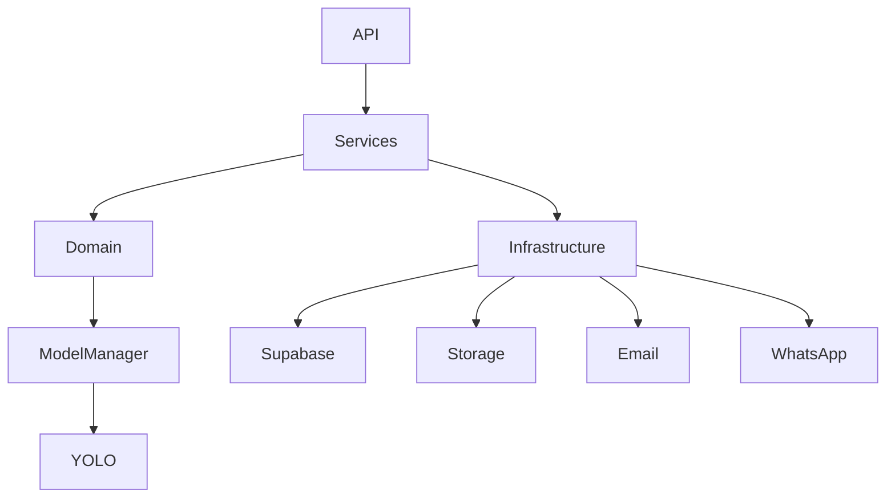
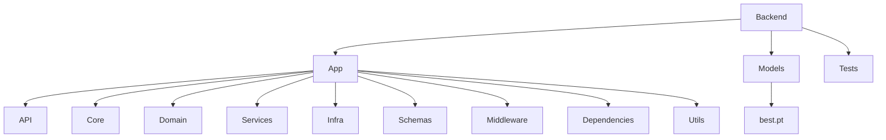
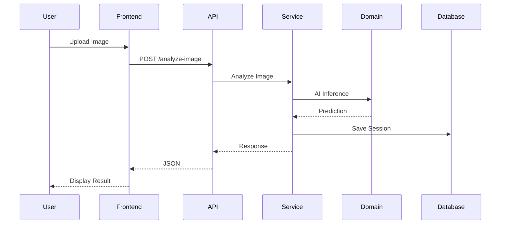

# AI-Based Driver Drowsiness Detection System
# Backend Architecture

**Version:** 1.0

**Document Type:** Backend Software Architecture Document (BSAD)

**Project Status:** Development

**Author:** Michael Magdy & Team

**Last Updated:** July 2026

---

> **Important for AI Assistants (Claude/ChatGPT):**
>
> This document defines the official backend architecture.
>
> All generated backend code must follow this architecture.
>
> Never redesign the project structure unless explicitly requested.
>
> Extend existing modules rather than replacing them.
>
> Business logic must never be written inside API endpoints.
>
> Follow SOLID principles, Clean Architecture, and Separation of Concerns.

---

# 1. Purpose

This document defines the complete backend architecture of the Driver Drowsiness Detection System.

It specifies:

- Folder organization
- Module responsibilities
- Communication between layers
- Dependency flow
- Coding rules
- AI integration
- Database access
- WebSocket architecture
- Error handling
- Future extensibility

The backend is designed as a modular, scalable, enterprise-grade FastAPI application.

---

# 2. Backend Goals

The backend is responsible for:

- Authentication
- Authorization
- AI inference
- Image analysis
- Video analysis
- Webcam streaming
- WebSocket communication
- Database operations
- Storage operations
- Report generation
- Notification delivery
- Analytics
- Logging
- System monitoring

The backend **does not** generate UI.

---

# 3. High-Level Backend Architecture

```
                    Frontend

                        │

           REST API / WebSocket

                        │

                        ▼

                 FastAPI Backend

                        │

      ┌─────────────────┼────────────────┐

      ▼                 ▼                ▼

 Business Logic      AI Engine      Infrastructure

      │                 │                │

      ▼                 ▼                ▼

 Database         PyTorch Model     Storage / Email

```

---

# 4. Backend Folder Structure

```
backend/

│

├── app/

│   ├── api/

│   ├── core/

│   ├── domain/

│   ├── infra/

│   ├── schemas/

│   ├── services/

│   ├── utils/

│   ├── middleware/

│   ├── dependencies/

│   └── main.py

│

├── models/

│       best.pt

│

├── tests/

├── scripts/

├── docs/

├── Dockerfile

├── docker-compose.yml

├── pyproject.toml

├── .env.example

└── README.md
```

---

# 5. Layer Responsibilities

The backend consists of independent layers.

Each layer has a single responsibility.

Layers communicate only with adjacent layers.

---

# 6. API Layer

Folder

```
app/api/
```

Purpose

Expose REST API endpoints.

Responsibilities

- Receive requests
- Validate input
- Authenticate users
- Call services
- Return responses

API endpoints must never contain business logic.

Example

```
POST /analyze-image

↓

Validate Request

↓

Call AIService

↓

Return JSON
```

---

# 7. Core Layer

Folder

```
app/core/
```

Purpose

Global application configuration.

Contains

- config.py
- logging.py
- security.py
- constants.py

Responsibilities

- Environment Variables
- JWT Validation
- Application Configuration
- Logging Configuration

---

# 8. Domain Layer

Folder

```
app/domain/
```

Purpose

Contains all AI business logic.

Submodules

```
models/

metrics.py

fsm.py

manager.py
```

Responsibilities

- Model loading
- Model switching
- AI inference
- EAR calculation
- MAR calculation
- Head Pose
- Fatigue score
- Decision logic

No HTTP requests.

No database access.

---

# 9. Services Layer

Folder

```
app/services/
```

Purpose

Business logic.

Future services

```
AIService

SessionService

VideoService

ReportService

AnalyticsService

NotificationService

StorageService

UserService
```

Services coordinate multiple modules.

Example

```
VideoService

↓

Extract Frames

↓

AIService

↓

Timeline Analysis

↓

Database

↓

Return Results
```

---

# 10. Infrastructure Layer

Folder

```
app/infra/
```

Purpose

External systems.

Contains

- Supabase Client
- Storage Client
- Email Client
- WhatsApp Client

Infrastructure never contains business logic.

---

# 11. Schemas Layer

Folder

```
app/schemas/
```

Purpose

Pydantic models.

Contains

- Requests
- Responses
- DTOs

Every endpoint must use schemas.

Never return raw dictionaries.

---

# 12. Utils Layer

Folder

```
app/utils/
```

Purpose

Reusable helper functions.

Examples

- Image utilities
- Video utilities
- File utilities
- Time utilities

Must remain stateless.

---

# 13. Middleware

Folder

```
app/middleware/
```

Responsibilities

- Logging
- CORS
- Rate limiting
- Request timing
- Exception handling

---

# 14. Dependencies

Folder

```
app/dependencies/
```

Contains FastAPI dependency injection.

Examples

- Current User
- Current Admin
- Database
- Model Manager

---

# 15. AI Engine

Location

```
app/domain/models/
```

Responsibilities

- Load best.pt
- GPU management
- CPU fallback
- Prediction
- Confidence
- Bounding Boxes

Future

Support

- YOLO
- RF-DETR
- Faster R-CNN

through ModelManager.

---

# 16. Model Manager

The project must use a ModelManager.

Responsibilities

- Load model
- Unload model
- Switch models
- Reload model
- Model metadata

API endpoints never communicate directly with YOLO.

Always through ModelManager.

---

# 17. Fatigue Decision Engine

Pipeline

```
Detection

↓

EAR

↓

MAR

↓

Head Pose

↓

Temporal Analysis

↓

Finite State Machine

↓

Fatigue Score

↓

Alert Level

```

This logic belongs inside the Domain layer.

---

# 18. Database Access

Only Services communicate with Infrastructure.

Never

API

↓

Database

Correct

API

↓

Service

↓

Infrastructure

↓

Supabase

---

# 19. Storage Access

Storage

```
videos/

images/

reports/

exports/

avatars/

temporary/
```

Storage handled only through StorageService.

---

# 20. Notification Flow

```
Detection

↓

Fatigue Engine

↓

NotificationService

↓

Email

WhatsApp

Alarm

```

API endpoints never send emails directly.

---

# 21. Error Handling

Every service returns structured exceptions.

Example

```
ModelNotLoadedException

StorageException

AuthenticationException

InferenceException
```

API converts exceptions into JSON responses.

---

# 22. Logging

Every important operation should be logged.

Examples

- Login
- Logout
- Upload
- AI Prediction
- Report Generation
- Alert
- Error

No sensitive information should be logged.

---

# 23. Dependency Rules

Allowed

```
API

↓

Services

↓

Domain

↓

Infrastructure
```

Forbidden

```
Domain

↓

API

```

Forbidden

```
Infrastructure

↓

API

```

---

# 24. Coding Standards

- Python 3.12
- FastAPI
- Type Hints
- Async where appropriate
- Pydantic
- Small functions
- SOLID
- DRY
- Clean Code
- No duplicated logic

---

# 25. Future Expansion

The architecture must support:

- Multiple AI models
- Fleet management
- Mobile application
- Cloud inference
- Multiple cameras
- Multi-GPU inference
- Explainable AI
- Edge deployment

without requiring structural redesign.

---

# Appendix A – Backend Dependency Diagram



---

# Appendix B – Backend Folder Diagram



---

# Appendix C – Request Flow



---

# Architecture Summary

The backend follows a layered architecture where each module has a single responsibility.

API endpoints handle communication only.

Services coordinate business operations.

The Domain layer contains AI logic and fatigue analysis.

Infrastructure communicates with external services such as Supabase, storage, and notifications.

This separation ensures maintainability, scalability, testability, and future extensibility while keeping the codebase clean and easy to understand.