<div align="center">

# 🚗 DriveAlert: Driver Drowsiness Detection

**See fatigue before it strikes.**

An end-to-end, AI-powered **Driver Monitoring System** that detects closed eyes and yawning in images and videos, and turns those detections into a driver state: **NORMAL**, **YAWNING** or **DROWSY / SLEEPING**.


<a href="videos/demo-drowsy.mp4">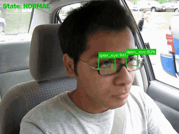</a> &nbsp; <a href="videos/demo-yawning.mp4">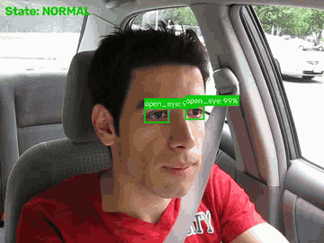</a>

</div>

The detector is a **Faster R-CNN built from scratch** in PyTorch (custom backbone, RPN, RoI Align and detection head), exported to **ONNX** and served by a **FastAPI** backend to a **React (TanStack Start)** web app backed by **Supabase**.

---

## 🎬 Demo

<!-- Add your deployed link here, e.g.: **Try it here:** 👉 **[driver-drowsiness.vercel.app](https://driver-drowsiness.vercel.app)** -->

### 🎥 Website walkthrough

A full tour of the DriveAlert web app: landing page, sign-in, uploading a driving video, running the analysis, the fatigue report, and session history with the detection timeline.

<a href="videos/website-demo.mp4">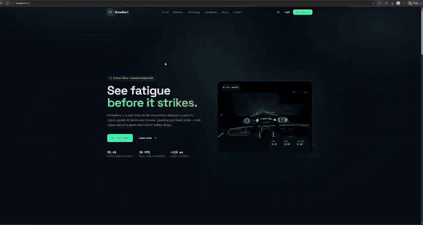</a>

<p align="center"><b><a href="videos/website-demo.mp4">▶ Watch the full walkthrough (5 min)</a></b></p>

### 📸 Screenshots

| Landing page | Sign in |
|:---:|:---:|
| 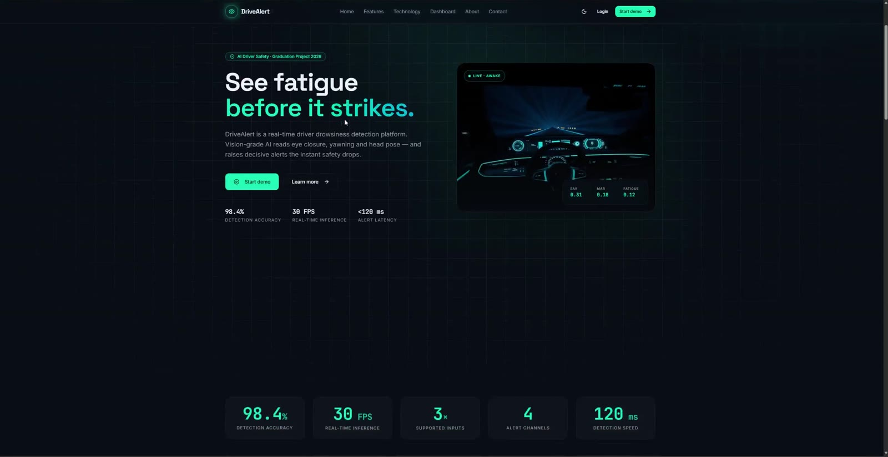 | 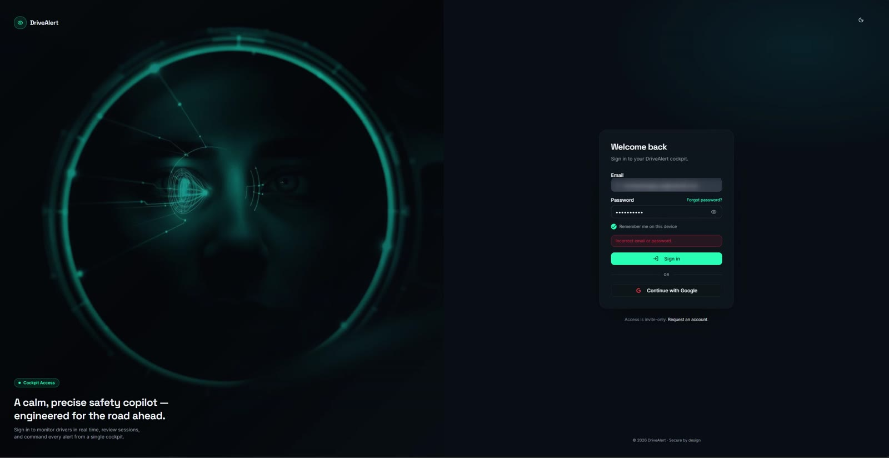 |
| **Video analysis & processing** | **Fatigue report** |
| 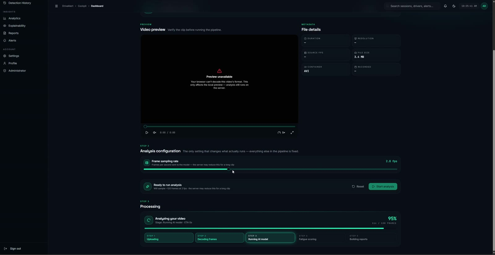 | 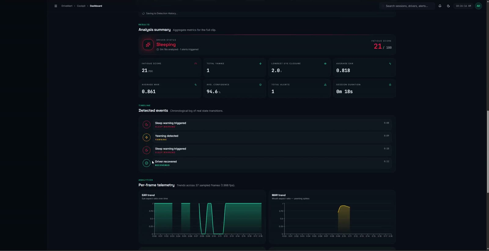 |

**Detection history with replay and timeline**

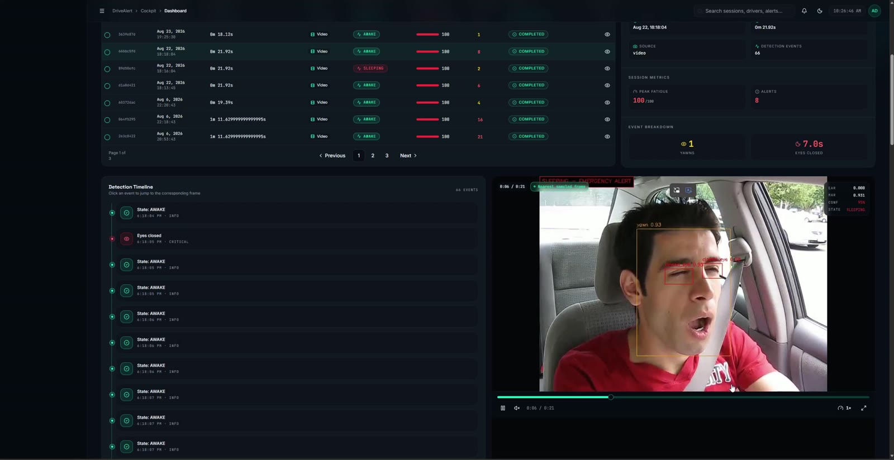

### 🔍 Model output examples

| Yawning | Eyes closed | Mixed eye state |
|:---:|:---:|:---:|
| 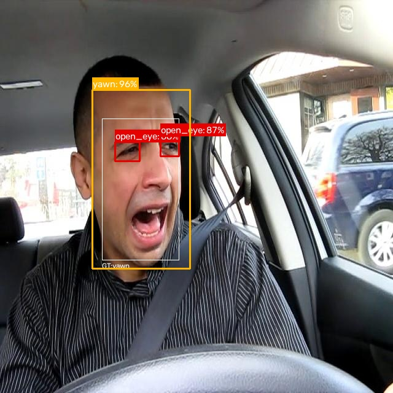 | 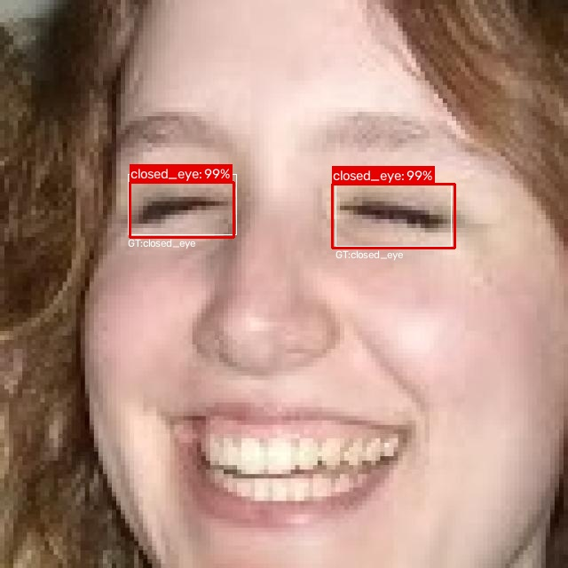 | 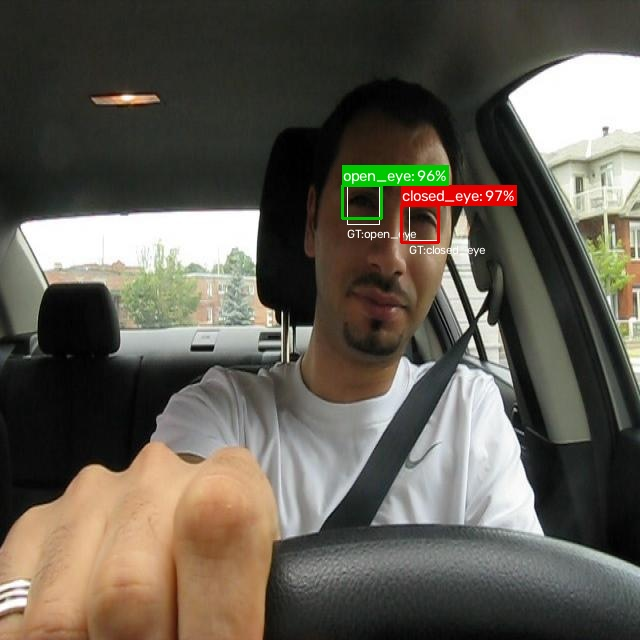 |

Coloured boxes are the model's predictions with confidence; thin white boxes (`GT:`) are the ground-truth labels.

---

## Table of Contents

- [Demo](#-demo)
- [Why this project](#why-this-project)
- [Features](#features)
- [How it works](#how-it-works)
- [Model performance](#model-performance)
- [Tech stack](#tech-stack)
- [Repository structure](#repository-structure)
- [Getting started](#getting-started)
- [API overview](#api-overview)
- [Training the model](#training-the-model)
- [Testing](#testing)
- [Deployment](#deployment)
- [Author](#author)

---

## Why this project

Driver fatigue is a leading cause of road accidents. Drivers close their eyes for too long, yawn repeatedly, and keep driving while sleepy. This project shows that a **standard camera plus computer vision** can watch for these signs and warn early, without expensive dedicated hardware.

It is built as a **complete software product**, not just a model: training pipeline, inference service, authentication, session history, analytics and an admin panel.

---

## Features

**AI detection**
- Object detection of three cues: `open_eye`, `closed_eye`, `yawn`
- Temporal driver-state logic, so a single noisy frame never triggers an alarm
- Image analysis and full **video analysis** with bounding boxes burned onto every frame (H.264, plays in any browser)

**Web application**
- Sign-up / login with Supabase Auth (JWT verified on the backend via JWKS, ES256)
- Dashboard, live monitoring, image and video analysis pages
- Session history with detection timeline and replay
- Analytics: AI performance, trends and event trends
- Alerts, reports, explainability and profile / settings pages

**Admin panel**
- User and role management
- Switch the active model, tune the score threshold and the inference device at runtime
- System health, storage and audit views

**Engineering**
- Layered FastAPI backend (API → services → domain → infra repositories)
- Consistent JSON response envelope and `X-Request-ID` on every response
- Hermetic unit and API test suite, with ruff / black / isort quality gates
- Multi-stage Docker images and a one-command Docker Compose stack

---

## How it works

```
 Camera / image / video
          │
          ▼
┌───────────────────────────┐     ┌──────────────────────────────┐
│  Frontend (TanStack Start)│◄───►│  Supabase                    │
│  React · Tailwind · shadcn│     │  Auth · Postgres · Storage   │
└────────────┬──────────────┘     └──────────────▲───────────────┘
             │ REST /api/v1 (JWT)                 │ service role
             ▼                                    │
┌─────────────────────────────────────────────────┴──────────────┐
│  Backend (FastAPI)                                              │
│  auth · sessions · uploads · analysis · analytics · admin       │
│                                                                 │
│  Faster R-CNN (ONNX Runtime)  ─►  Driver-state engine            │
│  boxes + labels + scores          NORMAL / YAWNING / DROWSY      │
└─────────────────────────────────────────────────────────────────┘
```

### The detector: Faster R-CNN from scratch

```
image [B,3,640,640]
  -> backbone (4 conv blocks, stride 16)   -> feature map [B,256,40,40]
  -> RPN + 14,400 anchors                  -> objectness + box offsets
  -> decode + NMS                          -> ~1,000 proposals
  -> RoI Align                             -> [N,256,7,7]
  -> detection head (FC)                   -> class scores + refined boxes
  -> final detections                      -> boxes + labels + scores
```

Two stages, four losses: `rpn_obj`, `rpn_box`, `det_cls`, `det_box`.

### From detections to a driver state

The detector only says *what is in this frame*. A separate temporal module (`DriverStateMonitor`) counts **consecutive** frames:

| State | Rule |
|---|---|
| **DROWSY / SLEEPING** | Closed eyes are the dominant eye signal for **15** consecutive frames |
| **YAWNING** | A yawn is detected for **12** consecutive frames |
| **NORMAL** | Otherwise; a visible open eye cancels a stray closed-eye box |

---

## Model performance

Evaluated on a held-out test set of **5,705 images** (IoU threshold 0.5):

| Metric | Score |
|---|---|
| **mAP@0.5** | **0.743** |
| mAP@0.5:0.95 | 0.346 |
| Precision | 0.710 |
| Recall | 0.826 |
| F1 | 0.764 |
| Mean IoU | 0.748 |

| Class | AP@0.5 |
|---|---|
| `yawn` | 0.821 |
| `closed_eye` | 0.732 |
| `open_eye` | 0.676 |

### Training curves

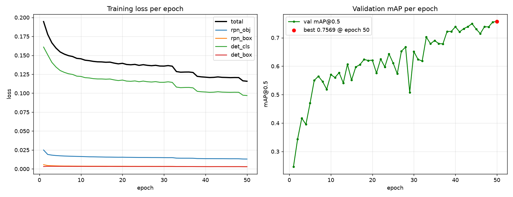

Trained for 50 epochs. All four losses decrease steadily, and validation mAP@0.5 peaks at **0.757 at epoch 50**.

Full results, including the confusion matrix, are in [`Backend/test_metrics_tuned.json`](Backend/test_metrics_tuned.json).

> **Why mAP and not accuracy?** Detection has to match many predicted boxes to many ground-truth objects and score both the label and the location (IoU). mAP, the area under the precision–recall curve averaged over classes, is the standard metric for that.

---

## Tech stack

| Layer | Technologies |
|---|---|
| **ML** | PyTorch, torchvision, OpenCV, NumPy, ONNX export |
| **Backend** | Python 3.12, FastAPI, Uvicorn, Pydantic v2, ONNX Runtime, OpenCV (headless), imageio-ffmpeg, PyJWT, Supabase client |
| **Frontend** | React, TanStack Start / Router / Query, Vite, Tailwind CSS, shadcn/ui (Radix), Recharts, Framer Motion, Zod |
| **Data & auth** | Supabase (Postgres, Auth, Storage) |
| **DevOps** | Docker (multi-stage), Docker Compose, Git LFS, pytest, ruff, black, isort |

---

## Repository structure

```
driver-drowsiness-detection/
├── ML/                     # Model research & training (not deployed)
│   ├── models/             # backbone, anchors, RPN, RoI head, Faster R-CNN
│   ├── utils/              # box utils, NMS, metrics, visualisation, driver_state
│   ├── train.py            # training loop, saves best.pth
│   ├── test.py / evaluate.py
│   ├── inference.py        # single-image detection
│   ├── webcam.py / video.py
│   ├── export_onnx.py      # PyTorch -> ONNX
│   └── architecture/       # design documents
│
├── Backend/                # FastAPI service (the deployed API)
│   ├── app/
│   │   ├── api/v1/         # routes: health, sessions, uploads, analysis, analytics, admin
│   │   ├── services/       # business logic
│   │   ├── domain/         # model backends (ONNX / PyTorch) + analysis logic
│   │   ├── infra/          # Supabase client, repositories, storage, JWKS, video encoder
│   │   ├── core/           # config, security, logging, exceptions
│   │   └── middleware/     # error handling, request context
│   ├── db/migrations/      # Supabase SQL migrations
│   ├── tests/              # unit + API tests
│   ├── best.onnx           # trained model (Git LFS)
│   └── Dockerfile
│
├── Frontend/               # TanStack Start web app
│   ├── src/routes/         # pages (dashboard, monitoring, video-analysis, admin, ...)
│   ├── src/components/     # UI + feature components
│   └── Dockerfile
│
├── docs/assets/            # screenshots, GIFs and result images for this README
├── videos/                 # demo videos
├── docker-compose.yml      # backend + frontend stack
├── DEPLOY.md               # deployment guide
└── MODEL_ARTIFACT.md       # how the model file is versioned
```

---

## Getting started

### Prerequisites

- **Git LFS** (required: the model file is stored with LFS)
- **Docker** + Docker Compose, *or* Python 3.12 and Node.js 20+
- A **Supabase** project (URL, publishable/anon key, service-role key)

### 1. Clone the repository

```bash
git lfs install
git clone https://github.com/michaelmagdyda/driver-drowsiness-detection.git
cd driver-drowsiness-detection
```

> If you cloned without Git LFS, `Backend/best.onnx` will be a ~133-byte pointer file. Run `git lfs pull` to fetch the real model. See [`MODEL_ARTIFACT.md`](MODEL_ARTIFACT.md).

### 2. Configure environment variables

```bash
cp Backend/.env.example Backend/.env      # backend secrets (never committed)
cp .env.docker.example .env               # frontend build-time values for Docker
```

In `Backend/.env`, set at least:

| Variable | Description |
|---|---|
| `SECRET_KEY` | Random secret. Generate with `python -c "import secrets; print(secrets.token_urlsafe(48))"` |
| `SUPABASE_URL` | Your Supabase project URL |
| `SUPABASE_SERVICE_ROLE_KEY` | Service-role key (server only, never expose to the browser) |
| `MODEL_PATH` | Path to the model, e.g. `best.onnx` |
| `ALLOWED_ORIGINS` | Comma-separated frontend origins for CORS |

In the root `.env`, set `VITE_SUPABASE_URL` and `VITE_SUPABASE_PUBLISHABLE_KEY`.

### 3a. Run with Docker (recommended)

```bash
docker compose build
docker compose up -d
```

| Service | URL |
|---|---|
| Frontend | http://localhost:3000 |
| API | http://localhost:8000/api/v1 |
| Swagger docs | http://localhost:8000/docs |

### 3b. Run locally without Docker

**Backend**

```bash
cd Backend
python -m venv .venv
# Windows: .venv\Scripts\activate    macOS/Linux: source .venv/bin/activate
pip install -r requirements.txt -r requirements-dev.txt
uvicorn app.main:app --reload --host 127.0.0.1 --port 8000
```

> To serve a PyTorch `.pth` checkpoint instead of ONNX, also install `requirements-torch.txt`.

**Frontend**

```bash
cd Frontend
npm install
npm run dev
```

Set `VITE_API_URL=http://127.0.0.1:8000/api/v1` in `Frontend/.env` for local development.

---

## API overview

All routes are under `/api/v1`. Interactive docs are at `/docs` (Swagger) and `/redoc`.

| Group | Endpoints |
|---|---|
| **Health** | `GET /health` · `GET /ready` · `GET /system/health` |
| **Analysis** | `POST /analysis/image` · `POST /analysis/video` · `GET /analysis/video/preview/{token}` |
| **Uploads** | `POST /uploads/image` · `POST /uploads/video` |
| **Sessions** | `GET /sessions` · `POST /sessions` · `GET /sessions/{id}` · `GET /sessions/{id}/events` · `DELETE /sessions/{id}` |
| **Analytics** | `GET /analytics/ai-performance` · `GET /analytics/trends` · `GET /analytics/event-trends` |
| **Admin** | `GET /admin/users` · `GET /admin/models` · `GET /admin/models/active` · `POST /admin/models/activate` · `POST /admin/models/threshold` · `POST /admin/models/device` |

Every response uses the same envelope:

```json
{ "success": true,  "message": "…", "data": { } }
{ "success": false, "message": "…", "error_code": "NOT_FOUND", "errors": [] }
```

---

## Training the model

The `ML/` folder contains the full training pipeline. The dataset uses YOLO-format labels (`class_id x_center y_center width height`, normalised 0–1), split 70 / 15 / 15.

```bash
cd ML
pip install -r requirements.txt

# train (creates data splits on first run, saves checkpoints/best.pth)
python train.py --device cuda:0 --epochs 30 --batch-size 4

# final evaluation on the held-out test split
python test.py --checkpoint checkpoints/best.pth --device cuda:0

# single image / webcam
python inference.py --image data/images/some.jpg --checkpoint checkpoints/best.pth --out result.jpg
python webcam.py --checkpoint checkpoints/best.pth --device cuda:0

# export to ONNX for the backend
python export_onnx.py
```

See [`ML/README.md`](ML/README.md) for details.

---

## Testing

```bash
cd Backend
python -m pytest

# quality gate
python -m ruff check app/ tests/
python -m black --check app/ tests/
python -m isort --check-only app/ tests/
```

Tests are hermetic: they never read your local `.env`.

---

## Deployment

The project deploys as a monorepo: the **FastAPI backend** (with the ONNX model) runs as a container service, the **frontend** on a Node/SSR host such as Vercel, and **Supabase** is hosted. In production (`APP_ENV=production`) the backend refuses to start unless `ALLOWED_ORIGINS` is an explicit, non-wildcard list.

Step-by-step instructions are in [`DEPLOY.md`](DEPLOY.md).

---

## Author

**Michael Magdy** & team

- GitHub: [@michaelmagdyda](https://github.com/michaelmagdyda)

If you find this project useful, please consider giving it a ⭐.
